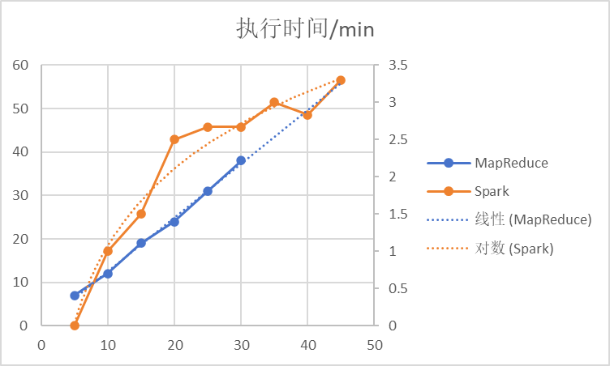

# 不同分布式计算框架在K-Means任务下的迭代性能分析

## 研究目的

本研究旨在深入探讨Spark框架相较于传统的MapReduce框架，在处理迭代计算任务时是否具备更优的性能和效率。

随着大数据处理需求的日益复杂，迭代算法变得越来越重要。而Spark以其内存计算模型著称，被认为能够显著提升此类任务的执行速度。

为了更好地理解当前迭代任务处理技术的发展，我们还将探究具有内存管理和状态处理机制的Flink框架是否也更优，来作为补充。

## 研究方法

对于主体实验的MapReduce vs Spark，我们尽量控制其他部分一致（数据集、聚类数量、聚类初始点选取方式、各结点计算资源等），通过比较随迭代次数的增加，不同框架对应执行时间增长趋势的差异来验证结论。

对于补充实验的Flink，也尽量控制其他部分一致，我们简单运行固定次数的迭代，查看每轮迭代所耗时间的变化。

## 研究结果

对于主体实验，随着迭代次数的增加，Spark执行时间增长有放缓的趋势（类似对数），而MapReduce执行时间增长十分均等（线性），从而表明至少在执行时间的角度，Spark比MapReduce更适合迭代任务。

对于补充实验，Flink前部分单轮迭代时间（如1.50s）普遍高于后部分单轮迭代时间（如1.09s），从而彰显对迭代任务的适应。

## 小组分工

- 组长：
  - 李昀翰（贡献度：20%）：项目整体构思和实验讨论、补充情景下Flink环境配置及简单实验
- 组员：
  - 邵高超（贡献度：30%）：项目整体构思和实验讨论；Spark环境配置及实验
  - 李增增（贡献度：30%）：项目整体构思和实验讨论；MapReduce环境配置及实验
  - 李传（贡献度：20%）：项目整体构思和实验讨论；实验结果分析、代码文档整理；PPT制作及汇报

